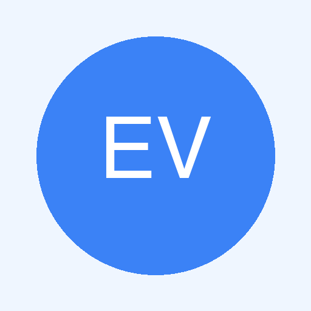

<p align="center"></p>

[](https://lazymac2x.github.io/lazymac-api-store/) [](https://coindany.gumroad.com/) [](https://mcpize.com/mcp/email-validator-api)

# email-validator-api

Comprehensive email validation API — syntax (RFC 5322), MX record lookup, disposable domain detection, role-based detection, SPF/DKIM checks, typo suggestions, and risk scoring (0-100). REST + MCP server.

## Quick Start

```bash
npm install && npm start  # http://localhost:3100
```

## Endpoints

### Validate Email
```bash
curl -X POST http://localhost:3100/validate \
  -H "Content-Type: application/json" \
  -d '{"email": "user@gmail.com"}'
# → {email, syntax, role, disposable, mx, domain, spf, dkim, typo, risk, deliverable}
```

### Batch Validate (up to 100)
```bash
curl -X POST http://localhost:3100/validate/batch \
  -H "Content-Type: application/json" \
  -d '{"emails": ["a@gmail.com", "b@fake.xyz"]}'
# → {total, valid, invalid, results}
```

### Domain Check
```bash
curl -X POST http://localhost:3100/domain \
  -H "Content-Type: application/json" \
  -d '{"domain": "gmail.com"}'
# → {domain, exists, mx, spf, dkim, is_disposable, is_free_provider, reputation_score}
```

### Typo Suggestion
```bash
curl -X POST http://localhost:3100/suggest \
  -H "Content-Type: application/json" \
  -d '{"email": "user@gmial.com"}'
# → {original, has_suggestion, suggested: "user@gmail.com", reason}
```

### MCP (JSON-RPC 2.0)
```bash
curl -X POST http://localhost:3100/mcp \
  -H "Content-Type: application/json" \
  -d '{"jsonrpc":"2.0","id":1,"method":"tools/list","params":{}}'
```

**MCP Tools:** `validate_email`, `validate_batch`, `check_domain`, `suggest_fix`

## License
MIT
